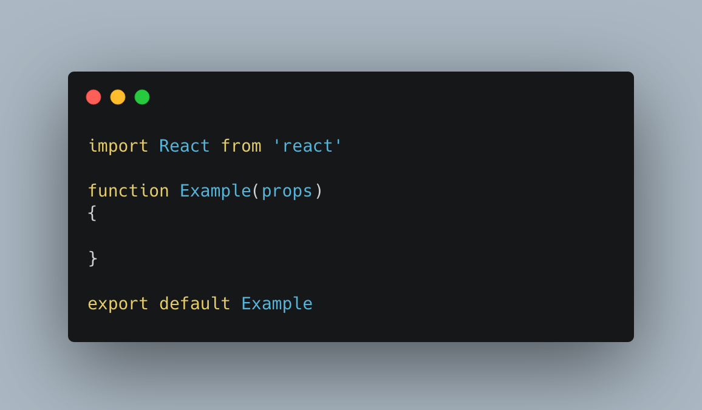

<!-- Huge Shoutout to Othneil Drew for this template
(https://github.com/othneildrew/Best-README-Template/blob/master/BLANK_README.md)
-->


<!-- PROJECT SHIELDS -->
<!--
*** I'm using markdown "reference style" links for readability.
*** Reference links are enclosed in brackets [ ] instead of parentheses ( ).
*** See the bottom of this document for the declaration of the reference variables
*** for contributors-url, forks-url, etc. This is an optional, concise syntax you may use.
*** https://www.markdownguide.org/basic-syntax/#reference-style-links
-->
[![Contributors][contributors-shield]][contributors-url]
[![Forks][forks-shield]][forks-url]
[![Stargazers][stars-shield]][stars-url]
[![Issues][issues-shield]][issues-url]
[![MIT License][license-shield]][license-url]
[![LinkedIn][linkedin-shield]][linkedin-url]


<!-- PROJECT LOGO -->
<br />
<p align="center">
  <h3 align="center">CRF</h3>

  <p align="center">
    A Simple React Component Creator
    <br />
    <a href="https://github.com/13sfaith/crf"><strong>Explore the docs »</strong></a>
    <br />
    <br />
    <a href="https://github.com/13sfaith/crf/issues">Report Bug</a>
    ·
    <a href="https://github.com/13sfaith/crf/issues">Request Feature</a>
  </p>
</p>


<!-- TABLE OF CONTENTS -->
## Table of Contents

* [About the Project](#about-the-project)
  * [Built With](#built-with)
* [Getting Started](#getting-started)
  * [Prerequisites](#prerequisites)
  * [Installation](#installation)
* [Usage](#usage)
* [Roadmap](#roadmap)
* [Contributing](#contributing)
* [License](#license)
* [Contact](#contact)
* [Acknowledgements](#acknowledgements)


<!-- ABOUT THE PROJECT -->
## About The Project

### Built With

* [Rust](https://www.rust-lang.org/)
* [structopt](https://docs.rs/structopt/0.3.16/structopt/)


<!-- GETTING STARTED -->
## Getting Started

To get a local copy up and running follow these simple steps.

### Prerequisites

To build your own verison of this script you will need.

* Cargo
* Rust
```sh
# if you use rustup update rust using:
rustup update
```

### Installation

1. Clone the repo
```sh
git clone https://github.com/13sfaith/crf.git
```
2. Build the release
```sh
cargo build --release
```
3. The executable is then stored in: 
```sh
./crf/target/release
```

<!-- USAGE EXAMPLES -->
## Usage

Create a react component either class or function (default class)

USAGE:
    crf [OPTIONS] <name>

FLAGS:
    -h, --help       Prints help information
    -V, --version    Prints version information

OPTIONS:
    -t, --type <comp-type>    Type of component (-t c or -t f) [default: c]

ARGS:
    <name>    Name of component

An example use case would be:


This would create a js file named "Example.js" in the current working directory 
The file would contain a boilerplate class file that would look like:


The default behavior of the tool is to create a class, however if you would like to make a functional component we've got you covered.

Simply use the function tag as such:


This will create a js file named "Example.js" with the following boilerplate:



Happy Hacking!

<!-- ROADMAP -->
## Roadmap

See the [open issues](https://github.com/13sfaith/crf/issues) for a list of proposed features (and known issues).


<!-- CONTRIBUTING -->
## Contributing

Contributions are what make the open source community such an amazing place to be learn, inspire, and create. Any contributions you make are **greatly appreciated**.

1. Fork the Project
2. Create your Feature Branch (`git checkout -b feature/AmazingFeature`)
3. Commit your Changes (`git commit -m 'Add some AmazingFeature'`)
4. Push to the Branch (`git push origin feature/AmazingFeature`)
5. Open a Pull Request


<!-- LICENSE -->
## License

Distributed under the MIT License. See `LICENSE` for more information.


<!-- CONTACT -->
## Contact

Spencer Faith - [@13sfaith](https://twitter.com/13sfaith) - 13sfaith@gmail.com

Project Link: [https://github.com/13sfaith/crf](https://github.com/13sfaith/crf)


<!-- ACKNOWLEDGEMENTS -->
## Acknowledgements

* [Rust Lang](https://www.rust-lang.org/)
* [Othneil Drew](https://github.com/othneildrew)


<!-- MARKDOWN LINKS & IMAGES -->
<!-- https://www.markdownguide.org/basic-syntax/#reference-style-links -->
[contributors-shield]: https://img.shields.io/github/contributors/13sfaith/repo.svg?style=flat-square
[contributors-url]: https://github.com/13sfaith/crf/graphs/contributors
[forks-shield]: https://img.shields.io/github/forks/13sfaith/repo.svg?style=flat-square
[forks-url]: https://github.com/13sfaith/crf/network/members
[stars-shield]: https://img.shields.io/github/stars/13sfaith/repo.svg?style=flat-square
[stars-url]: https://github.com/13sfaith/crf/stargazers
[issues-shield]: https://img.shields.io/github/issues/13sfaith/repo.svg?style=flat-square
[issues-url]: https://github.com/13sfaith/crf/issues
[license-shield]: https://img.shields.io/github/license/13sfaith/repo.svg?style=flat-square
[license-url]: https://github.com/13sfaith/crf/blob/main/LICENSE.txt
[linkedin-shield]: https://img.shields.io/badge/-LinkedIn-black.svg?style=flat-square&logo=linkedin&colorB=555
[linkedin-url]: https://linkedin.com/in/spencer-faith-725486194/
[product-screenshot]: images/screenshot.png
